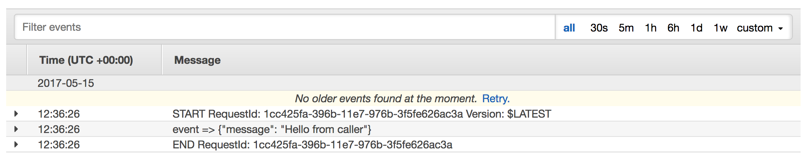

# AWS Lambda

## Lambda Invoke

> Lambda 코드상에서 다른 Lambda 호출하기

invoke API를 사용하면 Lambda function에서 다른 lambda function을 직접 호출할 수 있다.
API는 각 언어별 SDK에 포함되있다.

### Request parameters

- FunctionName : 함수 이름
- InvocationType : 요청 타입. 3가지 사용 가능
  - 'RequestResponse' : 기본 설정. 대상 Lambda function을 동기적으로 실행
  - 'Event' : 대상 Lambda function을 비동기적으로 실행
  - 'DryRun' : 호출 권한과 입력에 대한 검증만 하고 실제 실행하지는 않는다.
- LogType
  - 'None' : 미설정
  - 'Tail' : 'RequestResponse'로 실행할 때 사용할 수 있다. 실행 완료 후 응답에 로그의 뒷 부분을 일부 포함해서 반환한다.
- ClientContext : 클라이언트 정보를 전달한다.
- Payload : JSON Format의 문자열로 데이터를 전달한다. 실행되는 Lambda function의 event로 전달된다.
- Qualifier : 실행하려는 Lambda function의 version이나 alias를 지정한다.

### API Request Parameters

- FunctionName : 실행하려는 함수의 이름. 이름만 써도 되고 ARN을 써도 된다.
- InvocationType : 실행 타입 지정. 현재 3가지 설정이 있다.
  - **RequestResponse** : 기본값. 동기적으로 실행한다.
  - **Event** : 비동기적으로 실행한다.
  - **DryRun** : 실행 권한과 입력값에 대해 검증만 하고 실제로 실행하지는 않는다.
- LogType : 실행 후 반환되는 로그값에 대한 설정
  - **None** : 미설정
  - **Tail** : 로그의 마지막 4kb 부분만 반환받는다.
- Qualifier : 실행할 Lambda function의 version이나 alias를 지정할 수 있다.
- Payload : JSON 포맷의 문자열. 데이터 전달을 위해 사용하며, 실행할 Lambda function의 event인자로 전달된다.

### API Response Parameters

- StatusCode : HTTP status code
- FunctionError : 에러 발생 시 에러 타입을 반환
- LogResult : **RequestResponse**로 요청하고, 로그 설정을 지정했을 때 반환한다. Base64로 인코딩돼있다.
- Payload : 실행한 Lambda function의 반환 값

### Policy 설정

다른 Lambda function을 실행하는 Lambda function은 invoke에 대한 권한을 가진 Role이 설정돼있어야 한다.
'lambda:InvokeFunction'을 Role에 추가하면 된다.

```json
{
  "Version": "2012-10-17",
  "Statement": [
    {
      "Effect": "Allow",
      "Action": [
        "logs:CreateLogGroup",
        "logs:CreateLogStream",
        "logs:PutLogEvents",
        "lambda:InvokeFunction"
      ],
      "Resource": "*"
    }
  ]
}
```

### 간단한 코드 예시

데이터와 함께 다른 Lambda function을 실행하는 간단한 코드다.

- 다른 Lambda를 실행하는 Lambda

  ```python
  # caller
  import json
  import boto3

  client = boto3.client('lambda')

  def lambda_handler(event, context):
      payload = {
          'message': "Hello from Caller"
      }
      response = client.invoke(
          FunctionName="callee",
          Payload=json.dumps(payload)
      )
  ```

- 실행되는 Lambda

  ```python
  # callee
  import json

  def lambda_handler(event, context):
      print("event => " + json.dumps(event))
      return "Hello from callee"
  ```

위와 같이 'caller'와 'callee' 두 Lambda function을 만들고, 'caller'를 실행하면 CloudWatch Log를 통해 'callee'의 실행 로그를 확인할 수 있다.



### Reference

- [API Guide의 소개](http://docs.aws.amazon.com/ko_kr/lambda/latest/dg/API_Invoke.html)
- [boto3의 invoke API](http://docs.aws.amazon.com/ko_kr/lambda/latest/dg/API_Invoke.html)
