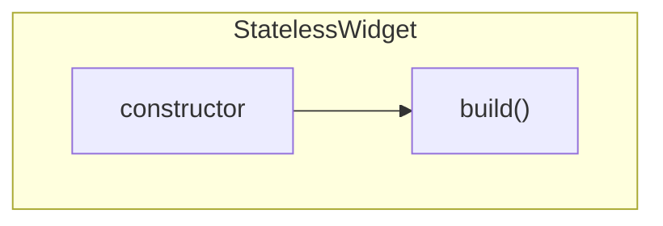
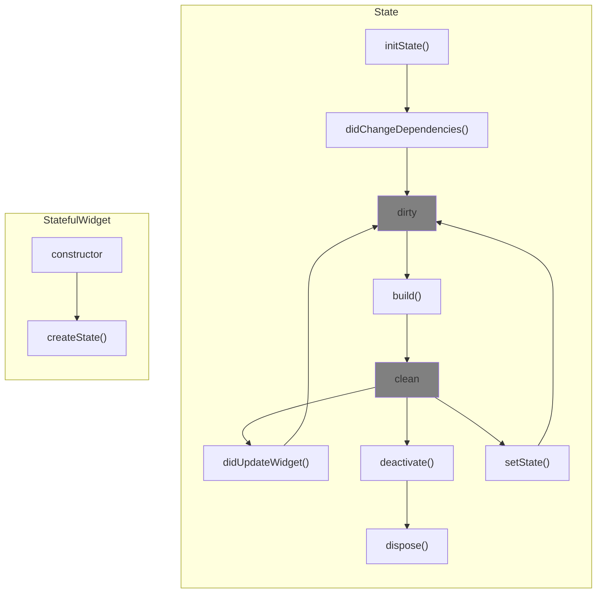

# 09장 전자액자 : 위젯 생명주기, PageView, Timer, SystemChrome, StatefulWidget

## 위젯 생명주기

### StatelessWidget



- 모든 위젯은 Widget 클래스를 상속하고, Widget 클래스는 불변 특성을 가진다.
  - 생성자에 새로운 매개변수가 입력되는 경우, build() 함수에서 해당 매개변수를 사용하고 있다면 새 인스턴스를 생성한 후 기존 인스턴스를 대체해서 변경 사항을 화면에 반영한다.

### StatefulWidget



#### 상태 변경이 없는 생명주기

1. StatefulWidget 생성자 실행
2. createState() 함수 실행, createState() 함수는 StatefulWidget과 연동되는 State를 생성한다.
3. initState() 실행, State가 생성되는 순간에만 한 번 실행되고 절대 다시 실행되지 않는다.
4. didChangeDependencies() 실행, State가 의존하는 값이 변경되면 재실행된다.
5. State의 상태가 dirty로 설정된다. dirty 상태는 build() 함수가 재실행돼야 하는 상태이다.
6. build() 함수가 실행되고 UI가 반영된다.
7. build() 실행 완료 후 clean 상태로 변경된다.
8. 위젯이 위젯 트리에서 사라지면 deactivate() 함수가 실행된다. State가 일시적 또는 영구적으로 삭제될 때 실행된다.
9. dispose()가 실행된다. 위젯이 영구적으로 삭제될 때 실행된다.

#### StatefuleWidget 생성자의 매개변수가 변경됐을 때의 생명주기

1. StatefulWidget의 생성자가 실행된다.
2. State의 didUpdateWidget() 함수가 실행된다.
3. State가 dirty 상태로 변경된다.
4. build() 함수가 실행된다.
5. State가 clean 상태로 변경된다.

#### State 자체적으로 build()를 재실행할 때 생명주기

1. setState()를 실행한다.
2. State가 dirty 상태로 변경된다.
3. build() 함수가 실행된다.
4. State가 clean 상태로 변경된다.

## Timer

Timer는 특정 시간이 지난 후에 일회성 또는 지속적으로 함수를 실행한다.

```dart
Timer.periodic(
    Duration(seconds: 3),
    (Timer timer) {},
)
```

## SystemChrome

시스템 UI의 그래픽 설정을 변경하는 기능을 제공한다.

```dart
SystemChrome.setSystemUIOverlayStyle(SystemUiOverlayStyle.light);
```
