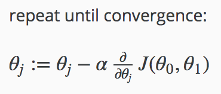

## Introduction

### Machine Learning의 정의

A computer program is said to learn from experience E with respect to some class of tasks T and performance measure P, if its performance at tasks in T, as measured by P, improves with experience E.

#### 나의 이해

- E : 학습으로 쌓인 경험
- T : 하려는 일. E를 통해 수행한다.
- P : E로 T를 했을 때의 성능

while P is enough:  
  E로 T를 한 P를 측정해 E를 향상시키고,

### Supervised vs. Unsupervised

- Supervised learning : 정답이 있는 데이터들이 있는 경우
- Unsupervised learning : 데이터가 있을 수 있지만 각 데이터들에 대한 정답은 없는 경우

### Supervised Learning

- Regression : 연속적인 특성을 지닌 값을 예측하는 경우
- Classification : 이산적인 특성을 지닌 값을 예측하는 경우

### Unsupervised

Clustering : 특성만으로 대상을 그룹화

## Model And Cost Function

### Model Representation

- Training Set (x, y) : 학습 데이터 집합
- h(hypothesis) : x와 y의 관계를 수학적으로 모델링
- parameters : h에서 사용하는 임의의 값.

주어진 (x, y)를 통해 최적의 h를 찾는다.

### Cost Function

최적의 h를 찾기 위해 parameter에 따른 h의 최적화 정도를 측정하는 계산식.

#### 나의 이해

즉, x와 y의 관계를 잘 표현할 수 있는 h를 찾아야 하고,
해당 h를 최적화하는 parameter를 찾기 위해 cost function을 정해야 한다.

h와 cost function을 모두 적합하게 정해야 좋은 결과를 얻을 수 있을 것이다.

## Parameter Learning

### Gradient Descent

- 시작지점(&#952;0,&#952;1)에 따라 도달하게되는 최적의 값이 다를 수 있다.
- &#945; : learning rate
  - 1회 계산마다 이동하는 크기에 영향을 준다.
  - 너무 작게 정하면 시간이 오래걸리고,
  - 너무 크게 정하면 overshooting, 최적값에 도달 못하고 엉뚱한 곳으로 튕겨나갈 수 있다.
- 현재 &#952;에서의 기울기에 따라 이동 방향과 크기가 결정된다. 기울기가 0인 쪽을 향해, 현재 기울기 크기와 &#945;에 비례하는 크기로 다음 &#952;를 재설정한다.

### Gradient Descent For Linear Regression

1. Gradient descent는 시작 지점에 따라 global optima에 도달하지 못할 수 있다.
2. Linear regression의 cost function은 local optima 없이 global optima만 있는 convex function이다.
3. Gradient descent로 찾은 Linear regression cost function의 optima는 global optima임이 보장된다.
