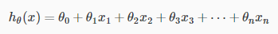
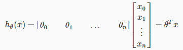
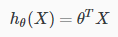
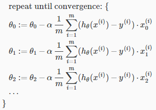

## Multivariate Linear Regression

### Multiple Feature

다변수 식으로 표현.

x0 = 1로 가정하고 다음과 같이 방정식 표현을 행렬식 표현으로.

### Gradient Descent For Multiple Variables

feature 수의 증가만큼 &#952;가 많아질 뿐, 변수가 하나일 때와 수식은 같다.

#### 나의 이해

기하학적으로 보면, &#952;는 해당 x(i) 차원에서의 독립적인 기울기다.(편미분한 값이니까)  
따라서 다른 x(other) 차원과는 관계가 없는 선형 독립적인 수치이다.  
그러므로 변수가 많아진 것, 즉 차원이 늘어나도 &#952;를 구하는 수식의 형태는 변하지 않는다.

### Gradient Descent in Practice I - Feature Scaling

여러 개의 feature들이 동일한 scale을 가지도록 조정한다.

mean normalization은 그 방법 중 하나.

#### 나의 이해

어떤 x는 규모가 억 단위일 수도 있고, 어떤 x는 한 자리수 내외일 수도 있다.  
각각 x(i)의 해당 차원 내에서의 수치 차가 y에 영향을 주어야지 어떤 한 x(i)차원의 규모가 다른 x(other)보다 y에 큰 영향을 주면 안된다. 그건 &#952;의 역할이다.

강의 예제를 예를 들면 집의 크기와 방의 수로 집의 가격을 계산할 때 그대로 계산하게 되면 집의 크기 차원이 값이 수식 전체에 영향력이 훨씬 크다.  
그렇게 얻은 결과는 집의 크기에만 크게 치우친 결과일 것이다.

### Gradient Descent In Practice II - Learning rate

gradient descent가 수렴할 것인지 또는 수렴한 것인지에 대한 판단 방법을 제시.

1. 반복 학습 회수에 따른 cost function 결과값을 그래프로 그려본다. 수렴하고 있는지 윤곽으로 알 수 있다.
2. Automatic convergence test  
  cost function 결과값의 감소값이 특정값보다 작아지면 수렴한다고 판단.

2번의 경우 특정 임계값을 정하는 것도 어려운 일이다. Ng형님은 1번을 주로 쓰신다고 한다.

강의 초반에도 얼핏 얘기하셨지만, learning rate가 너무 작으면 수렴하는데 너무 오래 걸리고
너무 크면 수렴 못할 거다.

### Features and Polynomial Regression

Training set의 형태가 직선으로 표현하기 적합하지 않은 경우, 다항식으로 모델링을 시도해 볼 수 있다.

다항식의 경우 x항들간의 차이가 커지므로 x항들을 scaling 하는 것이 매우 중요하다.

#### 나의 이해

다변수, 다항식 모델링을 학습할 수 있는 계산 능력이 있다면 엄청난거 아닌가?

모델링부터 엄청난 차이가 있겠지만.  
한 개 변수 다항식은 Training set로 점그래프를 찍어보면 눈으로도 모델링을 어느정도 정할 수 있지만, 다변수 다항식은 그런 수준이 아니다.

하지만 모델링 자체도 학습시킬 수 있다면...이미 하고 있겠구나.

## Computing Parameters Analytically

### Normal Equation

Cost function의 기울기가 0인 지점을 한번에 계산하는 방법.  
편미분을 이용한다.

반복 학습이 필요없고, learning rate 선정으로 고민할 필요도 없다.  
단, feature의 수가 매우 많아지면 역행렬을 구하는 시간이 오래걸리므로 Gradient Descent보다 느려진다.

절대적인 수치는 아니지만 Ng형님은 보통 feature 수가 10,000 이하일 때 정도만 Normal equation을 선택. 그 이상이라면 gradient descent나 다른 알고리즘을 사용할 것.

### Normal Equation Noninvertibility

역행렬을 구할 수 없을 때의 normal equation.  
하지만 흔히 있는 일도 아니고, 프로그래밍툴은 pseudo-inverse라고, 역행렬이 없어도 역행렬의 역할을 해주는 값을 구해준다. 어떤 방식으로 구해주는지 이해하지 못해도 쓰는 데에는 지장이 없다.

역행렬이 없는 경우 2가지 정도 짚어보자면,
1. 불필요한 feature 값들이 있는 경우, feature들이 서로 관련이 있으면 역행렬이 없을 수 있다.
2. feature수에 비해 training set의 수가 작거나 같을 때.

#### 내 생각

선형대수 뽐뿌가 오는 시간이었다.
