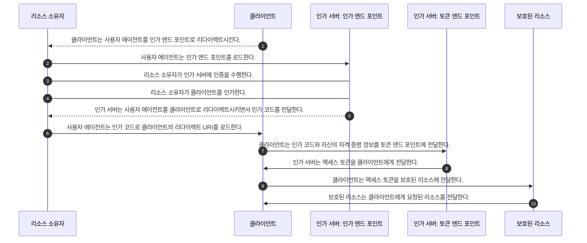

# 2장 OAuth 2.0의 기본

## **표준 OAuth 트랜잭션**

1. 클라이언트는 인가 서버의 리소스 소유자에게 인가를 요청한다.
2. 리소스 소유자는 클라이언트를 인가한다.
3. 클라이언트는 인가 서버로부터 토큰을 전달받는다.
4. 클라이언트는 보호된 리소스에 접근하기 위해 토큰을 사용한다.

> 여러 단계를 하나의 작업으로 묶어 절차를 최적화하는 경우가 많다.

## OAuth 2.0 인가 그랜트(Authorization Grant) 절차

