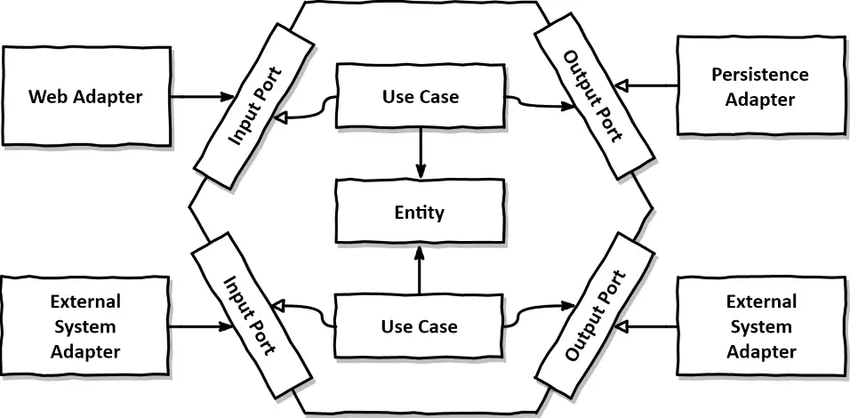

# 02. 의존성 역전하기

계층형 아키텍처의 대안은 단일 책임 원칙과 의존성 역전 원칙으로 시작한다.

## 단일 책임 원칙

- 컴포넌트를 변경하는 이유는 오직 하나뿐이어야 한다.
- 변경할 이유라는 것은 컴포넌트 간의 의존성을 통해 너무도 쉽게 전파된다.

## 의존성 역전 원칙

- 계층형 아키텍처에서 계층 간 의존성은 항상 다음 계층인 아래 방향을 가리킨다. 상위 계층들이 하위 계층들에 비해 변경할 이유가 더 많다. 보통 도메인 코드가 영속성 코드에 의존하게 되고 도메인 코드는 변경할 이유를 더 많이 가지게 된다.
- 전체 코드에서 도메인 코드가 가장 중요하고 다른 코드가 도메인 코드의 변경 이유가 되지 않게하고 싶다면, 도메인 코드의 다른 코드에 대한 의존성을 역전시켜서 도메인 코드를 변경할 이유를 줄일 수 있다.

## 클린 아키텍처

_이미지 출처: http://blog.cleancoder.com/uncle-bob/2012/08/13/the-clean-architecture.html_

- 로버트 C. 마틴이 '클린 아키텍처'라는 책에서 제안한 같은 이름의 아키텍처
- 도메인 코드가 바깥으로 향하는 어떤 의존성도 없는 구조다.
- 도메인 계층이 영속성이나 UI 같은 외부 계층과 철저하게 분리돼야 하므로 애플리케이션의 엔티티에 대한 모델을 각 계층에서 유지보수해야 하는 대가가 따른다. 하지만 덕분에 계층 간의 결합이 제거된다.

## 육각형 아키텍처

_이미지 출처: https://reflectoring.io/spring-hexagonal/_

- 클린 아키텍처의 원칙과 동일한 원칙을 적용하지만 더 구체적이다.
- 포트와 어댑터라는 개념을 사용하여 '포트와 어댑터(ports-and-adapters) 아키텍처'라도 부르기도 한다.
- 어댑터는 애플리케이션 코어와 다른 시스템 간의 상호작용을 담당한다.
- 포트는 애플리케이션 코어와 어댑터 간의 통신을 담당한다.
