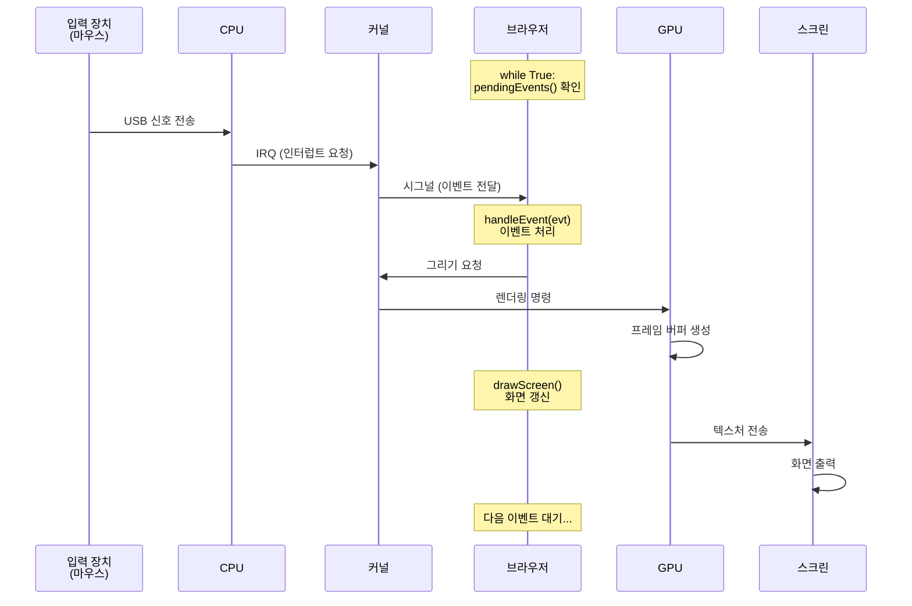

# Chapter 02 화면에 그리기

## 이론 학습

### 그래픽 애플리케이션의 처리 과정

### 모바일 대응

모바일 애플리케이션은 다음과 같이 더 많은 것들을 고려해야 한다. 이 책에서는 다루지 않는다.

- 가상 키보드, 터치 입력 지원
- 시각적 뷰포트 지원
- 핀치 줌 지원
- 전력 효율성 고려(e.g. GPU 하드웨어 활용)

### 페이지 스크롤

- 스크롤을 하려면 페이지의 좌표계와 화면의 좌표계 사이에 레이어 개념이 필요하다.
- 일반적으로 브라우저는 페이지 좌표계로 페이지를 레이아웃(페이지의 모든 요소가 어디에 있어야 하는지를 결정하는 것)하고 난 뒤에 화면 좌표계로 페이지를 렌더링한다.

### 더 빠른 렌더링

- 브라우저와 같은 그래픽 애플리케이션은 보통 프레임 레이트를 정확히 60Hz 이내에 다시 그리는 것을 목표로 한다. 즉 브라우저가 모든 작업을 60분의 1초, 즉 16밀리초 이내에 완료해야 한다. 16ms를 애플리케이션의 애니메이션 프레임 버짓(budget)이라고 한다.
- 실제 브라우저는 스크롤 속도를 높이기 위해 매우 까다로운 최적화를 많이 한다. 실습 브라우저에서는 화면 밖에 있는 문자를 그리지 않는 수준으로 조금만 개선해본다.
- 웹페이지에서 사용자의 모든 상호작용이 애니메이션처럼 부드럽게 동작해야 하는 것은 아니다. 마우스 클릭 같은 것이 대표적인데, 연구에 따르면 일반적으로 100ms 이내에만 반응하면 충분하고, 이보다 작은 경우에는 대부분의 사람이 동작에 불편한을 느끼지 않는다고 한다.(http://www.nngroup.com/articles/response-times-3-important-limits/)

## 실습

- Browser 클래스 구현
  - Tk를 사용해 새 윈도우를 열고 캔버스를 사용해 도형과 텍스트를 그려본다.
- 텍스트 배치하기
  - 이전 장의 show 함수 구현대로 HTML 문서의 텍스트를 반환하는 함수를 추가
  - load 메서드에서 해당 텍스트를 캔버스에 그린다. 글자마다 X, Y 위치값을 증가시키며 적당히 읽을 수 있게 그린다.
    - 다음 장에서 기본적인 타이포그래피 처리로 변경한다.
    - 파이어폭스와 크롬 모두가 사용하는 ICU 라이브러리(http://site.icu-project.org)는 문장성분의 경계를 추정하기 위해 빈도 표에 기반하여 동적 프로그래밍을 사용한다.
- 텍스트 스크롤하기
  - load 메서드에서 레이아웃과 렌더링을 분리하여 각각 layout 함수와 draw 메서드로 분리
  - 스크롤 처리를 위한 필드와 이벤트 핸들러를 추가한다.
  - 현재 구현에서 디스플레이 리스트를 저장하는 것으로 브라우저는 스크롤 할 때마다 layout을 수행하지는 않아 스크롤을 빠르게 처리된다. 현대 브라우저는 자바스크립트나 사용자의 상호작용으로 인해 웹페이지가 변경되더라도 디스플레이 리스트 대부분을 유지하도록 이 기능을 더욱 발전시켰다.
