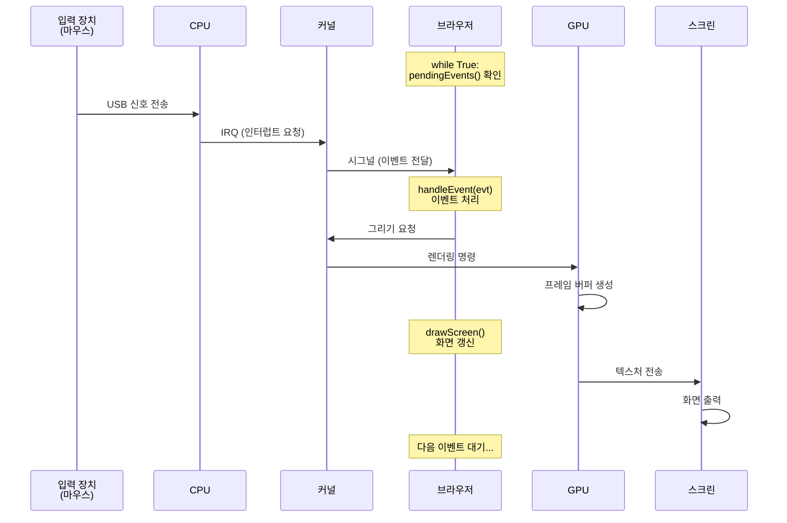

# Chapter 02 화면에 그리기

## 이론 학습

### 그래픽 애플리케이션의 처리 과정

### 모바일 대응

모바일 애플리케이션은 다음과 같이 더 많은 것들을 고려해야 한다. 이 책에서는 다루지 않는다.

- 가상 키보드, 터치 입력 지원
- 시각적 뷰포트 지원
- 핀치 줌 지원
- 전력 효율성 고려(e.g. GPU 하드웨어 활용)

## 실습

- Browser 클래스 구현
  - Tk를 사용해 새 윈도우를 열고 캔버스를 사용해 도형과 텍스트를 그려본다.
- 텍스트 배치하기
  - 이전 장의 show 함수 구현대로 HTML 문서의 텍스트를 반환하는 함수를 추가
  - load 메서드에서 해당 텍스트를 캔버스에 그린다. 글자마다 X, Y 위치값을 증가시키며 적당히 읽을 수 있게 그린다.
    - 다음 장에서 기본적인 타이포그래피 처리로 변경한다.
    - 파이어폭스와 크롬 모두가 사용하는 ICU 라이브러리(http://site.icu-project.org)는 문장성분의 경계를 추정하기 위해 빈도 표에 기반하여 동적 프로그래밍을 사용한다.
