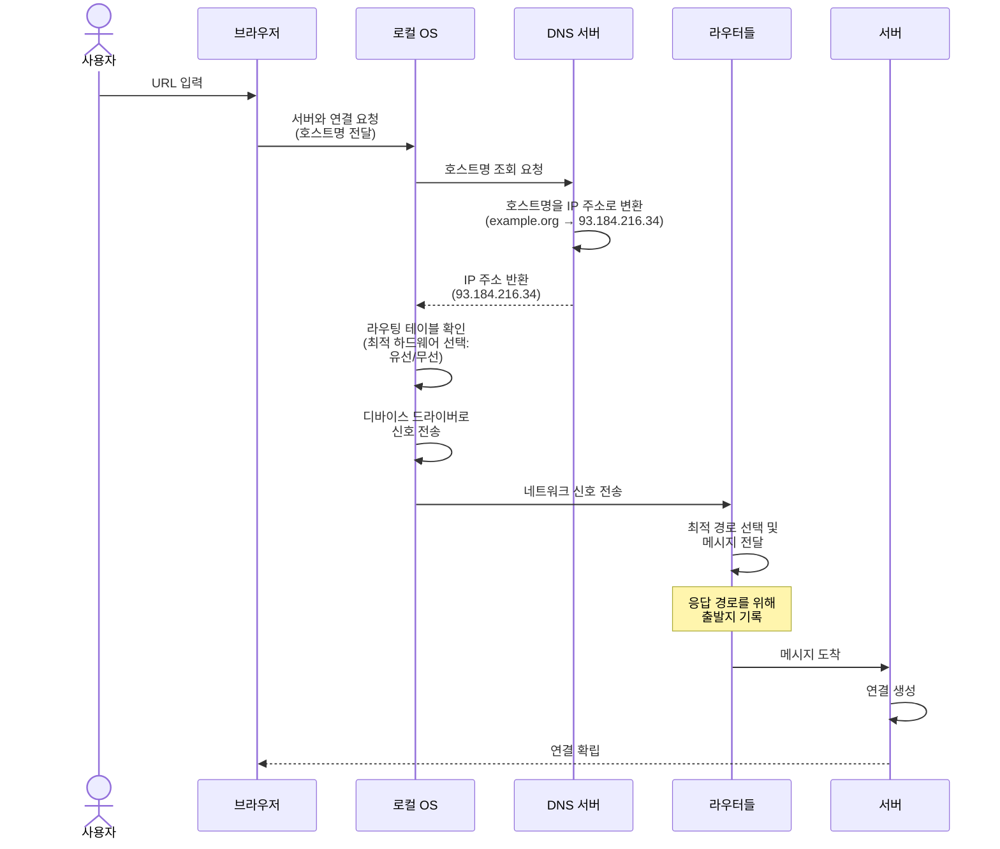

# Chapter 01 웹페이지 다운로드

## 이론 학습

### URL 구조

- 스킴, 호스트, 경로, 포트, 쿼리, 프래그먼트 등
- 정의: [RFC 3986](https://datatracker.ietf.org/doc/html/rfc3986)

### 서버 연결 과정

### 정보 요청

서버와 연결된 후 브라우저는 HTTP 프로토콜로 요청을 주고받는다.

## 실습

## 웹 브라우저는 URL로 서버의 정보를 다운로드할 수 있어야 한다.

- URL 클래스 구현
  - 스킴 처리
