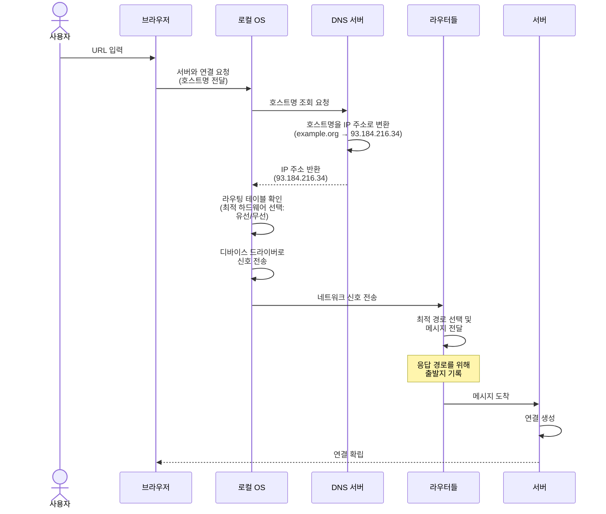

# Chapter 01 웹페이지 다운로드

## 이론 학습

### URL 구조

- 스킴, 호스트, 경로, 포트, 쿼리, 프래그먼트 등
- 정의: [RFC 3986](https://datatracker.ietf.org/doc/html/rfc3986)

### 서버 연결 과정

### 정보 요청

서버와 연결된 후 브라우저는 HTTP 프로토콜로 요청을 주고받는다.

## 실습

## 웹 브라우저는 URL로 서버의 정보를 다운로드할 수 있어야 한다.

- URL 클래스 구현
  - 생성자
    - URL을 파싱하여 scheme, host, path를 추출한다.
    - 일단 http 스킴만 지원한다.
  - request 메서드
    - 대상 host의 80번 포트로 TCP 연결을 생성한다.
      - 최신 버전의 HTTP는 TCP 대신 QUIC 프로토콜을 사용한다. 실습에서는 HTTP 1.0을 지원한다.
    - HTTP 요청을 생성하고 서버에 전송한다.
      - 줄바꿈을 위해 `\n`이 아닌 `\r\n`을 사용해야 한다.
      - 마지막은 반드시 `\r\n`을 두 번 보내야 한다. 그렇지 않으면 서버는 계속 줄바꿈을 기다린다.
      - 요청은 문자열이 아닌 바이트로 전송해야 한다. 파이썬에서는 문자열의 `encode` 메서드를 사용한다.
    - 서버의 응답을 받아 처리한다.
      - 바이트를 문자열로 인코딩한다.
        - 실습에서는 utf8로 하드코딩 처리를 한다. 실제로는 Content-Type 헤더에 따라 인코딩 처리를 하거나 문자 빈도를 기반으로 인코딩을 추측하는 처리를 할 수 있다.
      - 응답 문자열의 첫 번째 줄은 상태(HTTP 프로토콜의)로 처리한다.
        - 실습에서는 생략하지만 HTTP 버전 확인도 필요하다. HTTP 1.0을 요청해도 HTTP 1.1 응답하도록 잘못 설정된 서버들이 많다.
      - 응답 헤더에 `Transfer-Encoding`이나 `Content-Encoding`이 설정되어 있다면, 바디 데이터의 압축을 해제하는 처리가 필요할 수 있다.
        > 서버는 웹페이지를 전송하기 전에 `Content-Encoding` 헤더를 사용해 압축을 진행할 수 있습니다.
        > 텍스트가 많은 대형 웹페이지를 압축하면 페이지 로드가 빨라질 수 있습니다.
        > 브라우저는 자신이 지원하는 압축 알고리즘을 알려주기 위해 `Accept-Encoding` 헤더를 전송해야 합니다.
        > `Transfer-Encoding` 헤더도 비슷한 기능을 하는데 압축뿐 아니라 데이터를 '쪼개서(chunked)' 전송함을 알려줍니다.
