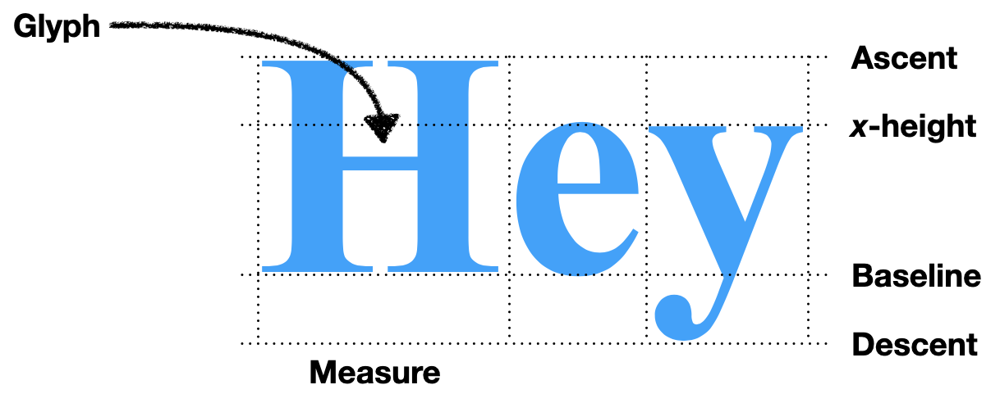

# Chapter 3 텍스트 포맷팅하기

## 이론 학습

### 텍스트 측정하기

- tk 폰트 객체의 metrics와 measure 메서드를 이용해 텍스트가 차지하는 가로세로 공간을 측정할 수 있다. 이 정보를 사용하여 페이지에 텍스트를 배치할 수 있다.

### 하이픈 연결

단어 중간에 줄을 끊는 것을 하이픈 연결이라고 한다. hyphens CSS 속성을 통해 설정할 수 있다. 이를 구현하는 가장 최신 기술은 커누스 리앙 하이픈 연결 알고리즘(http://www.tug.org/docs/liang/liang-thesis.pdf)으로 단어 조각 사전을 사용하여 하이픈 연결이 가능한 지점의 우선순위를 정한다. 처음에는 CSS 스펙 문서가 이 알고리즘과 호환되지 않았지만(https://news.ycombinator.com/item?id=19482922), 지금은 text-wrap-style 속성에서 이 문제가 해결되어 있다.

## 실습

- layout 함수 구현 변경
  - 영어와 같이 단어 중간에 다음 줄로 이동할 수 없는 텍스트를 처리하기 위해 글자 단위 배치를 단어 단위 배치로 변경한다.
  - 폰트 객체의 메서드를 이용해 단어의 크기를 측정하고 위치를 계산해서 배치한다.
  - 실습 구현에서는 화이트스페이스로 단어를 분할한다. 단어 사이에 공백이 없는 중국어에서는 문제가 생긴다. 실제 브라우저는 단어 경계를 식별하는 목적을 포함하여 텍스트 레이아웃을 위해 언어마다 다른 규칙을 적용한다.
- lex 함수에 텍스트 스타일 태그(`<b>`, `<i>`) 처리 추가
  - 텍스트 스타일을 적용하기 위해 토큰 리스트를 반환하도록 변경한다.
  - 토큰은 `Text`, `Tag` 두 가지 종류로 분류한다.
- layout 함수 구현 변경
  - 텍스트가 아닌 토큰을 받아 처리하도록 변경한다. 태그 토큰을 확인하여 글꼴을 변경할 수 있다.
- Layout 객체
  - 복잡해지고 있는 layout 함수를 클래스로 확장한다.
  - 토큰 처리와 단어 크기 계산 처리를 각각 token, word 메서드로 분리한다.
  - 태그 토큰에 `<big>`, `<small>` 태그에 대한 처리를 추가한다.
- Browser.draw 메서드 변경
  - Layout 객체가 처리한 단어별 폰트 정보를 사용해서 텍스트를 그린다.
- Layout 처리 개선
  - 한 줄에 다양한 크기의 단어를 출력하기 위한 처리를 추가한다.
    - 큰 텍스트와 작은 텍스트가 한 줄에 있을 때, 기준선에 따라 작은 텍스트를 아래로 이동시켜야 한다. 큰 텍스트를 위로 올리면 이전 줄과 겹친다.
    - 모든 단어의 크기를 알아야 해당 줄의 수직 정렬을 계산할 수 있기 때문에 2패스 알고리즘이 필요하다. 첫 번째 패스에는 줄에 어떤 단어가 들어가는지 식별한다 x 위치를 계산한다. 두 번째 패스는 단어를 수직으로 정렬하고 y 위치를 계산한다.
  - ` `, `
` 태그에 대한 처리를 추가한다.
- 폰트 최적화 처리 추가
  - 폰트 객체를 매번 생성하지 않고, 동일한 폰트 옵션에 대해서는 한 번만 폰트 객체를 생성하고 딕셔너리에 저장 후 재사용하는 처리를 추가한다.
