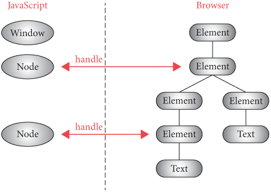

# Chapter 9 대화형 스크립트 실행하기

## 이론 학습

### 자바스크립트의 Node 객체와 브라우저의 Element/Text 객체 사이의 관계

자바스크립트의 Node 객체와 브라우저의 Element/Text 객체 사이는 핸들을 통해 유지된다.

## 실습

- 자바스크립트 파일 로드
  - Tab 클래스의 load 메서드에서 `<script>` 태그의 src 속성값을 자바스크립트 파일의 URL로 파싱하고 해당 URL로 요청을 보내 자바스크립트 파일 내용을 읽어온다.
    - `<script>` 태그의 시작 태그와 끝 태그 사이에 자바스크립트 코드를 직접 넣을 수도 있지만, 실습 브라우저는 해당 기능을 지원하지 않는다. 자바스크립트 코드에 포함된 작다('<')와 크다('>') 기호 때문에 파싱하기 어렵다.
  - 읽어온 자바스크립트 코드는 스타일과 레이아웃 처리 전에 수행한다.
    - 실제 브라우저는 기본적으로 전체 페이지가 파싱된 후가 아니라 `<script>` 태그를 파싱하자마자 자바스크립트를 실행한다. 실습 브라우저는 스크립트 태그에 defer가 있는 경우와 비슷하다. 기본 정책을 효율적으로 구현하는 것은 훨씬 더 까다롭다.
- 파이썬의 print 함수와 자바스크립트의 console.log 함수 바인딩
  - 파이썬에서 자바스크립트로 함수를 익스포트해야 한다. 실습 과정에서 많은 함수를 익스포트하므로 해당 책임을 관리하기 위한 JSContext 클래스를 추가한다.
  - JSContext 클래스는 DukPy의 JSInterpreter 객체를 소유하고, 자바스크립트 코드를 실행하는 run 메서드를 제공한다. JSInterpreter 객체는 모든 자바스크립트 변수의 값을 저장하고, 여러 자바스크립트 스니펫을 실행하고 변수의 값과 그 밖의 상태를 공유할 수 있다.
  - Tab 객체의 load 메서드는 페이지 로드시 JSContext를 초기화하고 현재 로드하는 페이지의 모든 스크립트를 실행한다.
    - 모든 스크립트에서 하나의 JSContext를 사용하는 부수 효과로 두 개 이상의 스크립트를 실행할 때 먼저 실행된 스크립트에서 선언한 변수를 이후 실행하는 스크립트에서도 사용 가능하다.
  - JSInterpreter 객체의 `export_function` 메서드를 사용해서 파이썬의 함수를 해당 자바스크립트 런타임으로 익스포트할 수 있다. JSInterpreter로 실행되는 자바스크립트 런타임에서는 `call_python` 메서드를 사용해서 파이썬에서 익스포트한 함수를 호출할 수 있다. 이 점을 응용하여 call_python 메서드로 "log" 이름으로 익스포트한 `print` 함수가 정의된 console 객체의 정의를 자바스크립트 런타임에 전달하면, 이후 자바스크립트 실행에서 console.log 함수 호출시 파이썬의 print 함수가 호출된다.
- 자바스크립트 런타임에 DOM API 제공: 실습 브라우저에서는 다음 API만 간략하게 구현한다.
  - `querySelectorAll`: 실제 브라우저는 NodeList를 반환하지만 실습 브라우저는 배열을 반환
  - `getAttribute`
  - `innerHTML`: 실습 브라우저는 쓰기만 지원하고 읽기는 지원하지 않음
- `querySelectorAll` 지원
  - 자바스크립트 런타임에 익스포트하기 위한 `querySelectorAll` 메서드를 JSContext 클래스에 구현한다.
  - `querySelectorAll` 메서드는 호출시 전달받은 셀렉터를 CSSParser로 파싱하고, 파싱된 셀렉터를 사용하여 현재 페이지의 모든 노드를 순회하며 셀렉터에 매칭되는 노드를 찾아 배열로 반환한다. JSContext 클래스에서 노드 트리에 접근할 수 있도록 생성시 Tab 객체를 전달받는다.
  - Element 클래스로 정의된 노드 배열을 그대로 자바스크립트 런타임에 반환하면 정상적으로 전달할 수 없다. 따라서 간접 참조를 위한 '핸들'을 반환한다.
  - 핸들 매핑을 관리하기 위해 `node_to_handle`, `handle_tonode` 맵 필드를 JSContext 클래스에 추가하여 사용한다. 
  - `console.log` 구현과 마찬가지로 `querySelectorAll` 메서드를 익스포트하고, 자바스크립트 런타임에는 `call_python` 메서드로 `querySelectorAll` 함수를 호출하는 함수를 `document` 객체의 함수로 정의한다. 자바스크립트 런타임의 `querySelectorAll` 함수는 파이썬 런타임으로부터 반환된 handle을 Node 객체로 래핑해서 반환한다.
    - 실제 브라우저에서 `querySelectorAll`은 여기와는 관계없는 난해한 이유로 NodeList 객체를 반환한다.
    - 실습 브라우저에서는 `querySelectorAll`를 호출할 때마다 매번 Node 객체를 생성한다. 실제 브라우저는 그렇지 않다.
- `getAttribute` 지원
  - 자바스크립트의 Node 객체에 `getAttribute` 함수를 추가한다. `getAttribute` 함수는 브라우저에서 익스포트한 `getAttribute` 함수를 호출하고 결과를 반환한다. 호출할 때 대상 노드 요소를 특정 수 있는 핸들을 전달한다.
  - JSContext 클래스는 핸들과 속성 이름을 전달받아 핸들에 해당하는 노드의 속성을 반환하는 `getAttribute` 메서드를 구현하고 익스포트한다.
- 이벤트 처리
  - 브라우저는 이벤트 감지시 해당 이벤트를 자바스크립트 런타임에 전달한다.
    - 자바스크립트 런타임으로 이벤트를 전달하는 `dispatch_event` 메서드를 JSContext 클래스에 구현한다.
    - 지금까지 Tab 클래스에 구현한 'click', 'keydown', 'submit' 이벤트 처리에서는 `dispatch_event` 메서드를 통해 자바스크립트 런타임의 Node 객체가 제공하는 `dispatchEvent` 함수를 호출해서 이벤트를 전달한다.
  - 자바스크립트 런타임은 이벤트 리스너를 관리하고, 전달받은 이벤트에 매칭되는 이벤트 리스너를 호출한다.
    - 이벤트 리스너를 추가하기 위한 `addEventListener` 함수를 Node 객체에 추가한다.
    - 이벤트를 전달받아 해당 이벤트에 매칭되는 이벤트 리스너를 호출하는 `dispatchEvent` 함수를 Node 객체에 추가한다.
- innerHTML 쓰기 지원
  - 자바스크립트 런타임에 익스포트할 `innerHTML_set` 메서드를 JSContext에 구현한다.
    - 전달받은 문자열을 HTMLParser로 파싱하고 결과 노드를 대상 노드의 자식 노드로 추가한다.
    - HTMLParser로 파싱할 때 실습 브라우저는 HTML 조각을 html과 body로 감싸는 편법을 사용한다. 실제 브라우저는 표준화된 파싱 알고리즘(https://html.spec.whatwg.org/#parsing-html-fragments)을 사용한다.
    - 페이지가 변경되었으므로 render 메서드를 호출하여 업데이트한다.
      - 전체 페이지에 대해 레이아웃을 재수행하는 것은 비효율적인데 이에 대해서는 16장에서 다시 다룬다.
  - 자바스크립트 런타입에서는 Node 객체에 `innerText` 속성을 정의하고, setter 함수가 브라우저가 익스포트한 innerHTML_set 함수를 실행하도록 구현한다.
  - innerHTML를 통해 `<script>`나 `<link>` 엘리먼트를 추가할 수 있지만 현재 구현은 해당 방식을 지원하지 못한다.
  - 이 구현에는 메모리 릭이 있다. 만약 자바스크립트에서 HTML 엘리먼트에 접근하고 innerHTML을 사용해 페이지에서 그 엘리먼트를 삭제하면, 파이썬은 그 Element 객체를 가비지 컬렉션 할 수 없다. 참고: [Cross-Component Garbage Collection](https://research.google/pubs/cross-component-garbage-collection/)
- Event.preventDefault 지원
  - 자바스크립트 런타임에 Event 객체를 정의한다. Event 객체는 브라우저의 기본 동작 취소 여부를 저장하기 위한 `do_default` 속성을 저장한다.
  - 기존 `dispatchEvent` 함수가 Event 객체를 사용해서 이벤트를 다루도록 변경한다. 또한 반환값으로 Event 객체의 `do_default` 속성값을 반환한다. 브라우저는 이 값을 참조하여 기본 동작 실행 여부를 결정한다.
  - 파이썬 런타임의 `EVENT_DISPATCH_JS` 코드도 Event 객체를 사용하도록 변경한다.
  - Tab 클래스의 이벤트 처리는 `dispatch_event` 메서드를 호출 결과를 참조하여 기본 동작 처리를 제어한다.
